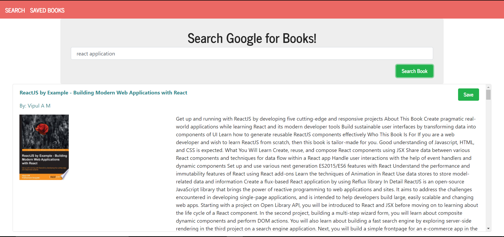
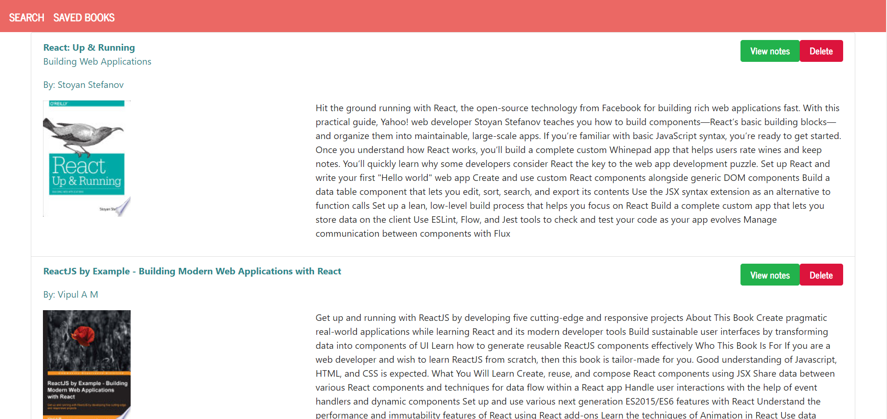
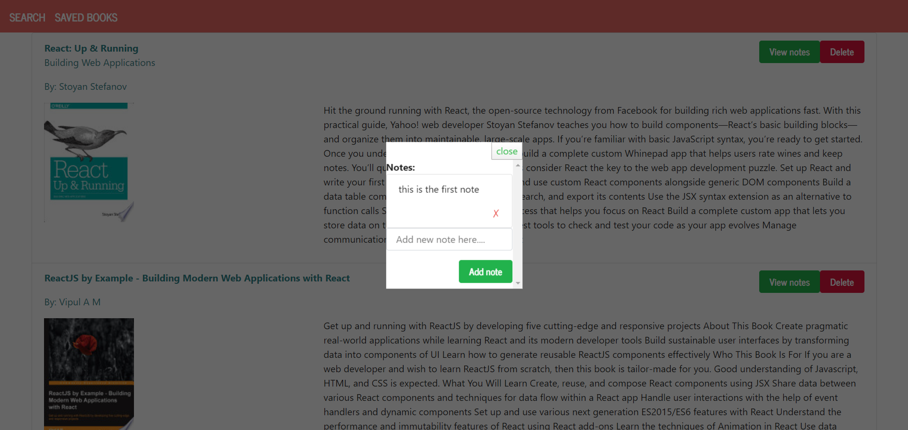

# SearchGoogleBook

## Overview

This is a React-based Google Books Search app. This app works with helper/util functions, and utilize React lifecycle methods to query and display books based on user searches. It also uses Node, Express and MongoDB so that users can save books to review or purchase later.

## Getting Started
These instructions will get you a copy of the project up and running on your local machine for development and testing purposes.

### Installing
Git clone the repository to your local machine:

HTTPS:
```
https://github.com/AmjedAyoub/searchgooglebook.git
```
SSH:
```
git@github.com:AmjedAyoub/searchgooglebook.git
```
Open the cloned repository in your visual studio.

You will then be able to start the app locally by running:

```
npm install
```

```
npm start
```

## Screenshots

### Search page


### Saved Books page


### Book Notes modal


## Technologies & Tools
* React.js
* Express
* MongoDB

## Links
This program is deployed on [Heroku](https://searchgooglebook.herokuapp.com/).\
This program is published on [GitHub](https://github.com/AmjedAyoub/searchgooglebook).

## Authors
See contribution history [here](https://github.com/AmjedAyoub/searchgooglebook/graphs/contributors).

